https://visualvm.github.io/download.html
https://visualvm.github.io/gettingstarted.html
https://htmlpreview.github.io/?https://raw.githubusercontent.com/visualvm/visualvm.java.net.backup/master/www/heapdump.html
https://visualvm.github.io/documentation.html

1. Инициализация программы
    Консоль: Please open 'ru.netology.JvmExperience' in VisualVm
Объяснение: Программа просит открыть её в VisualVM для мониторинга. 
Это важно для наблюдения за использованием памяти (Heap, Metaspace) и загрузкой классов.
    Графики:
Heap: Начальное состояние, память почти не используется.
Metaspace: Начальное состояние, загружены только базовые классы JVM и классы программы.
Classes: Загружены только классы программы и системные классы.

2. Загрузка классов в Metaspace
    Консоль: 20:00:37.085813300: loading io.vertx
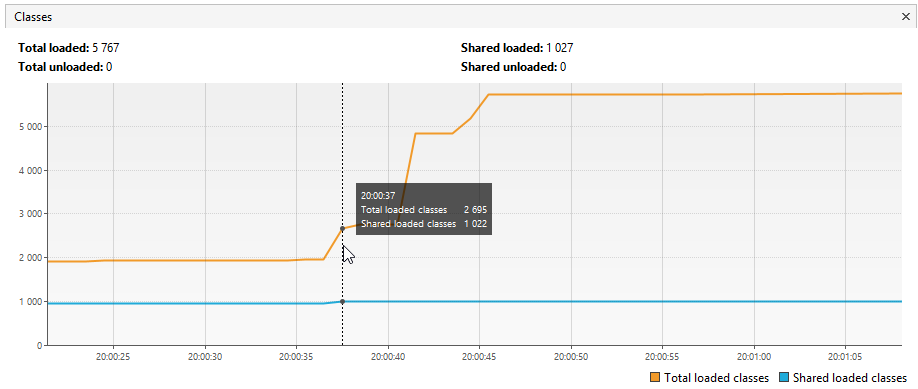
Объяснение: Программа начинает загружать классы из пакета io.vertx с помощью библиотеки
Reflections. Это приводит к увеличению использования Metaspace.
    Графики:
Metaspace: Увеличивается, так как загружаются классы из io.vertx.
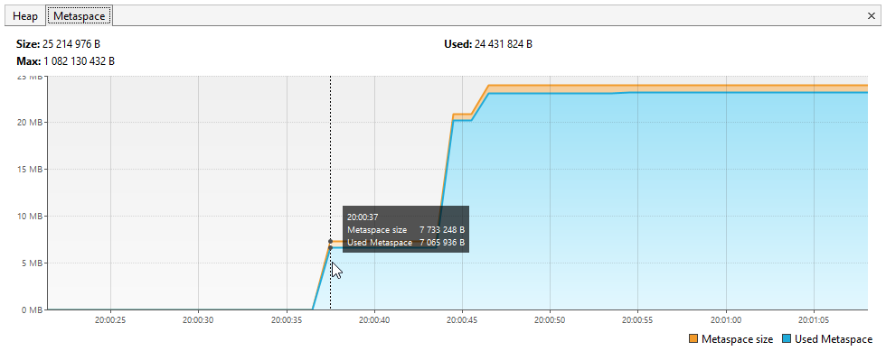
Classes: Количество загруженных классов увеличивается.
    Консоль: 20:00:37.519887100: loaded 529 classes
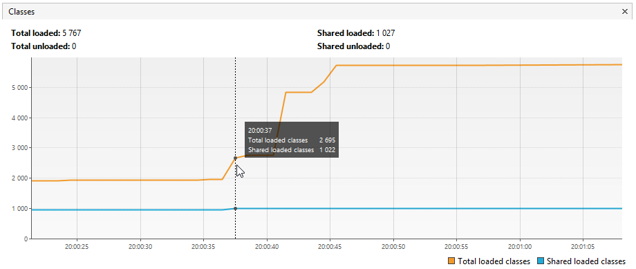
Объяснение: Загружено 529 классов из пакета io.vertx. Это завершение первого этапа
загрузки классов.
    Графики:
Metaspace: Увеличивается на объем, занятый метаданными 529 классов.
Classes: Количество загруженных классов увеличивается на 529.

3. Пауза и загрузка классов из io.netty
    Консоль: 20:00:40.532080: loading io.netty
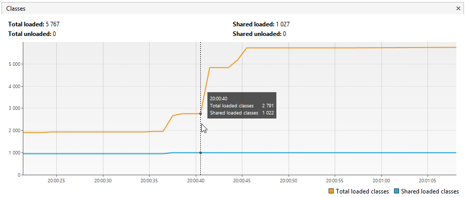
Объяснение: Программа начинает загружать классы из пакета io.netty. 
Это второй этап загрузки классов.
    Графики:
Metaspace: Увеличивается, так как загружаются классы из io.netty.
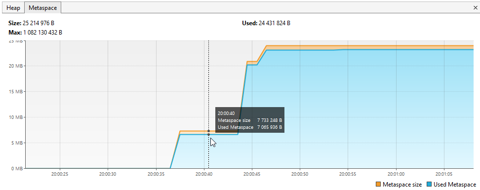
Classes: Количество загруженных классов увеличивается.
    Консоль: 20:00:41.321714600: loaded 2117 classes
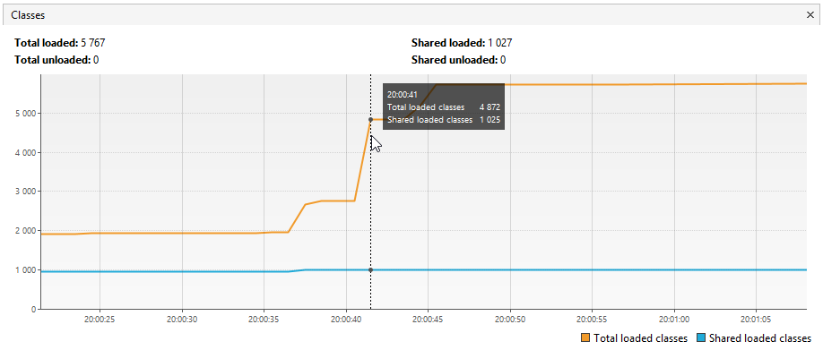
Объяснение: Загружено 2117 классов из пакета io.netty. Это завершение второго
этапа загрузки классов.
    Графики:
Metaspace: Увеличивается на объем, занятый метаданными 2117 классов.
Classes: Количество загруженных классов увеличивается на 2117.

4. Пауза и загрузка классов из org.springframework
    Консоль: 20:00:44.326357300: loading org.springframework
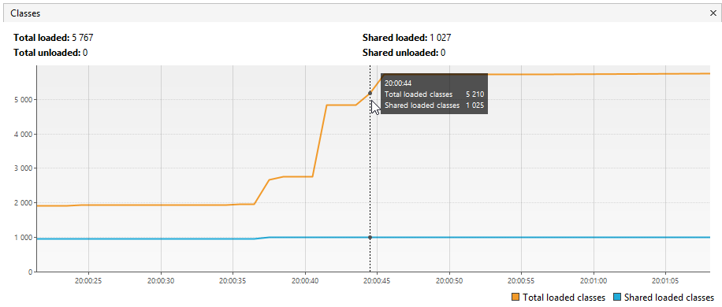
Объяснение: Программа начинает загружать классы из пакета org.springframework. 
Это третий этап загрузки классов.
    Графики:
Metaspace: Увеличивается, так как загружаются классы из org.springframework.
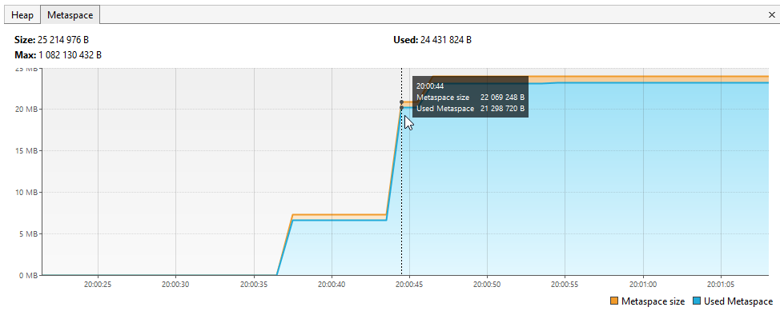
Classes: Количество загруженных классов увеличивается.
    Консоль: 20:00:44.633199900: loaded 869 classes
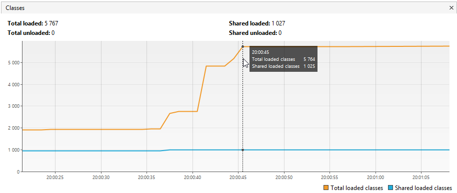
Объяснение: Загружено 869 классов из пакета org.springframework. 
Это завершение третьего этапа загрузки классов.
    Графики:
Metaspace: Увеличивается на объем, занятый метаданными 869 классов.
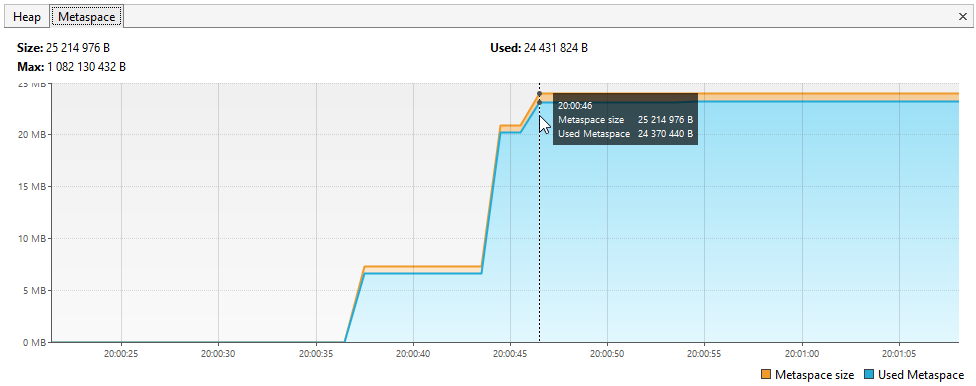
Classes: Количество загруженных классов увеличивается на 869.

5. Создание объектов в Heap
    Консоль: 20:00:47.637503900: now see heap

Объяснение: Программа переходит к созданию объектов в Heap. 
Это демонстрация использования оперативной памяти.
    Графики:
Heap: Начинает увеличиваться по мере создания объектов.
    Консоль: 20:00:47.637503900: creating 5000000 objects
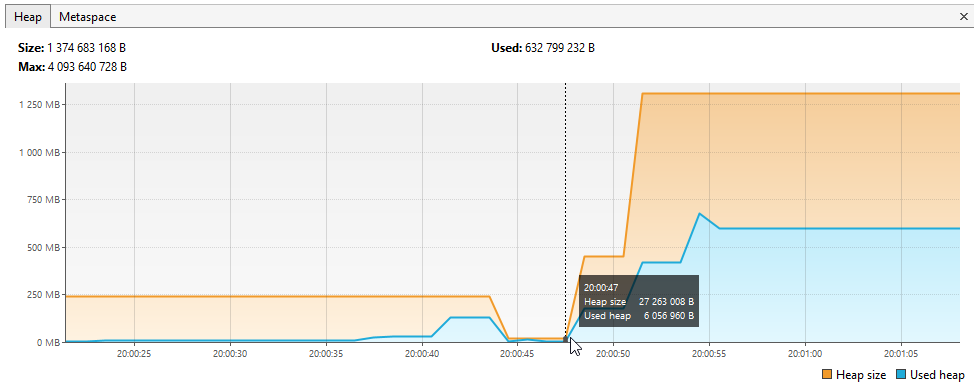
Объяснение: Программа начинает создавать 5 000 000 объектов типа SimpleObject.
    Графики:
Heap: Резко увеличивается, так как создается большое количество объектов.
    Консоль: 20:00:47.939615200: created
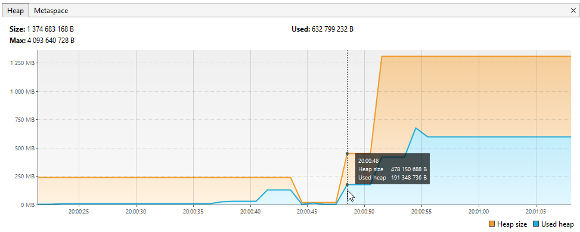
Объяснение: Создание 5 000 000 объектов завершено. Память в Heap занята этими объектами.
    Графики:
Heap: Остается на высоком уровне, так как объекты продолжают занимать память.

6. Добавление еще 5 000 000 объектов
    Консоль: 20:00:50.943039900: creating 5000000 objects
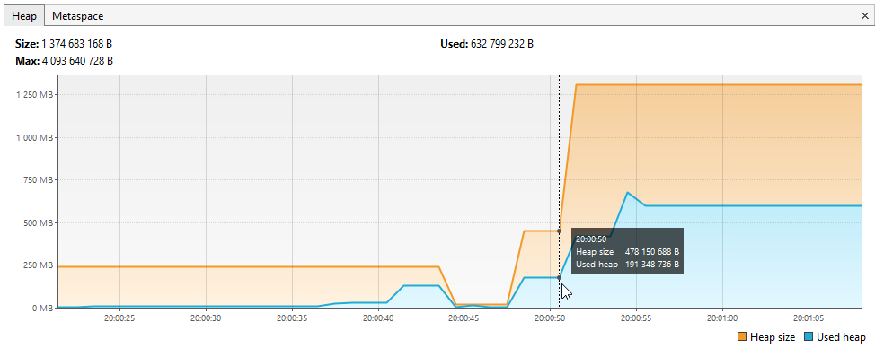
Объяснение: Программа создает еще 5 000 000 объектов.
    Графики:
Heap: Увеличивается еще больше.
    Консоль: 20:00:51.155105200: created
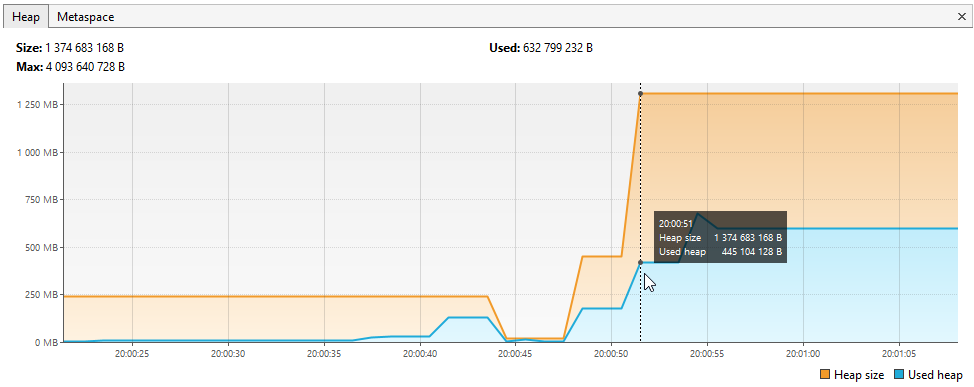
Объяснение: Создание еще 5 000 000 объектов завершено.
    Графики:
Heap: Остается на очень высоком уровне.

7. Добавление последних 5 000 000 объектов
    Консоль: 20:00:54.215419900: creating 5000000 objects
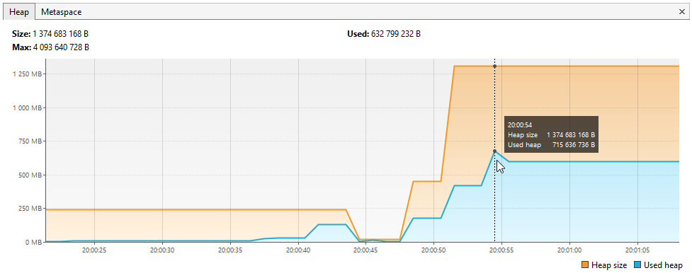
Объяснение: Программа создает последние 5 000 000 объектов.
    Графики:
Heap: Увеличивается до максимума.
    Консоль: 20:00:54.345015600: created
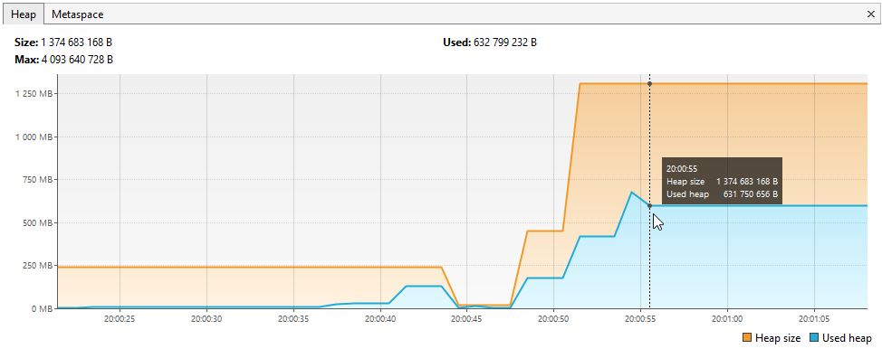
Объяснение: Создание последних 5 000 000 объектов завершено.
    Графики:
Heap: Остается на максимальном уровне.

Итог:
- Metaspace: Увеличивался трижды при загрузке классов из io.vertx,
io.netty и org.springframework.
- Heap: Резко увеличивался при создании 15 000 000 объектов.
- Classes: Количество загруженных классов увеличивалось при каждой загрузке пакетов.
Если мы хотим сделать программу более показательной, можно:
Увеличить количество создаваемых объектов (например, до 10 000 000 за раз).
Увеличить количество загружаемых пакетов (например, добавить java.util 
или другие большие пакеты).
